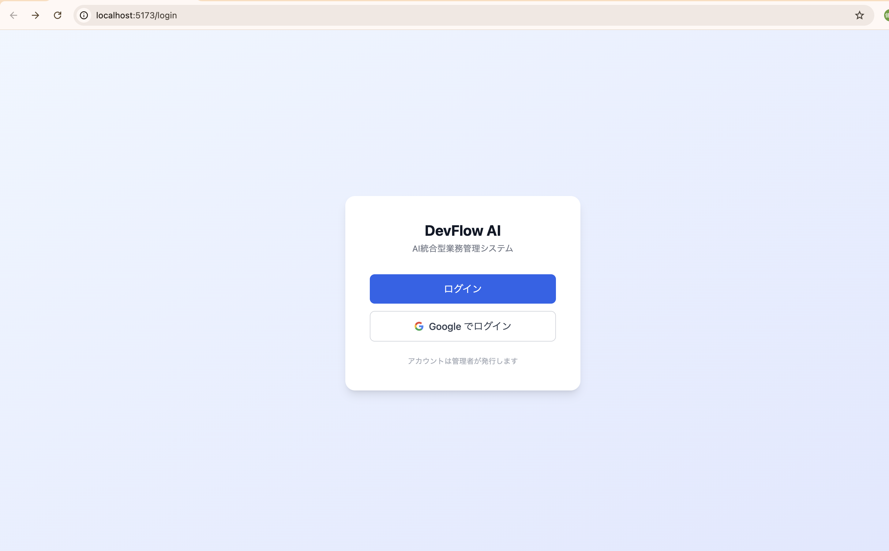
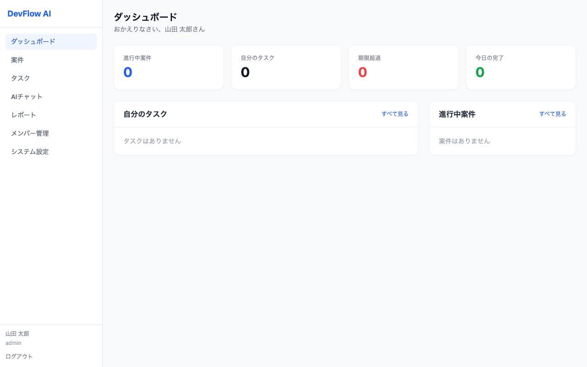
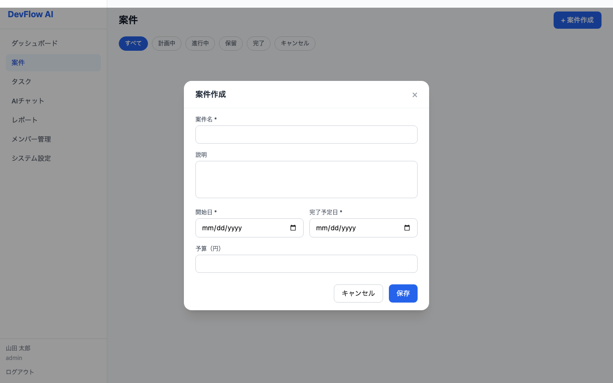
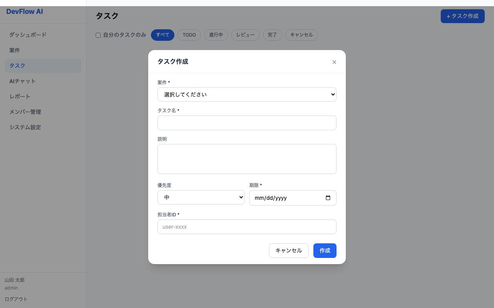
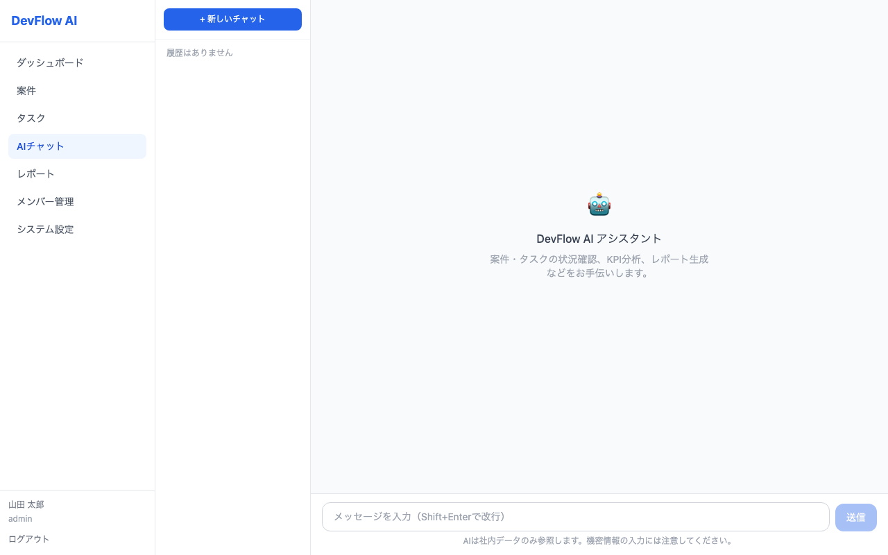
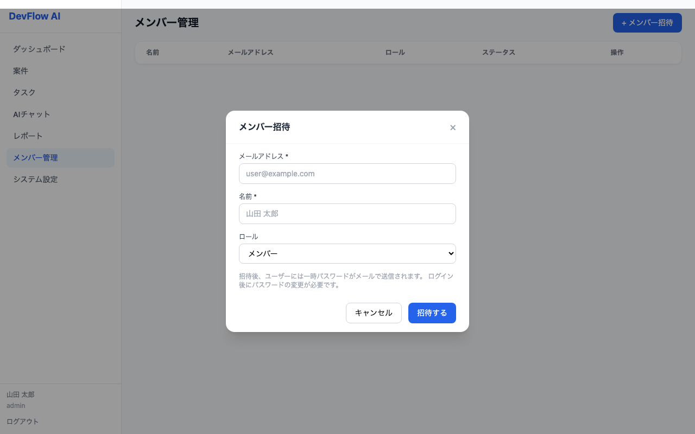

<div align="center">

# DevFlow AI

**AI-Powered Business Management System for IT Development Teams**

[](https://www.typescriptlang.org/)
[](https://www.python.org/)
[](https://react.dev/)
[](https://aws.amazon.com/cdk/)
[](https://langchain-ai.github.io/langgraph/)
[](https://hono.dev/)
[](LICENSE)

<br />

<p align="center">
  <strong>LangGraph + AWS Bedrock（Claude 3.5 Sonnet）を活用した AI エージェントで<br>
  案件・タスク管理とレポート自動生成を実現するエンタープライズ業務管理システム</strong>
</p>

<p align="center">
  <a href="#-スクリーンショット">スクリーンショット</a> ·
  <a href="#-設計ドキュメント">設計ドキュメント</a> ·
  <a href="#-アーキテクチャ">アーキテクチャ</a> ·
  <a href="#-技術スタック">技術スタック</a> ·
  <a href="#-getting-started">Getting Started</a>
</p>

</div>

---

## 🎯 プロジェクト概要

**DevFlow AI** は、IT システム開発会社の業務管理を AI で革新するエンタープライズ向けシステムです。

| 課題 | DevFlow AI の解決策 |
|---|---|
| 📊 進捗レポート作成に毎週数時間かかる | AI が自動でデータを集計・レポートを生成 |
| 📁 案件情報の属人化・散在 | 案件・タスクを一元管理 + AI による即時検索 |
| ⏰ タスク期限の見落とし | リアルタイム期限超過検知・ダッシュボード通知 |
| 👥 チーム稼働の偏り | AI による負荷分析・タスク再配分の提案 |

### ✨ 主要機能

- **🤖 AI アシスタント** — LangGraph ReAct エージェント + Bedrock Claude 3.5 Sonnet による自然言語での業務データ分析・レポート自動生成
- **📋 案件管理** — プロジェクト進捗トラッキング・ステータス管理（計画中 / 進行中 / 保留 / 完了）・担当者アサイン
- **✅ タスク管理** — 優先度・期限管理・ステータスフィルタ（TODO / 進行中 / レビュー / 完了）・モーダルで即時作成
- **👤 メンバー管理** — ロールベースアクセス制御（Admin / Manager / Member）・招待メール自動送信
- **🔒 エンタープライズセキュリティ** — AWS WAF + Cognito MFA（TOTP）+ Google SSO + OWASP Top 10 対応

---

## 📸 スクリーンショット

### ログイン — Cognito HostedUI + Google SSO 対応

<div align="center">
  
</div>

<p align="center"><em>メール + パスワード認証 / Google SSO の 2 方式に対応。アカウントは管理者が発行する招待制。</em></p>

---

### ダッシュボード — KPI カード・案件進捗・タスク一覧を一元表示

<div align="center">
  
</div>

<p align="center"><em>進行中案件数・自分のタスク・期限超過・今日の完了をリアルタイム集計。ロール別に表示内容を切り替え。</em></p>

---

### 案件管理 / タスク管理 — モーダルによる即時作成

<div align="center">
  
  
</div>

<p align="center"><em>左: 案件作成（案件名・期間・予算）/ 右: タスク作成（優先度・期限・担当者）<br>一覧画面を離れずモーダルでその場で登録。ページ遷移なしのシームレスな UX。</em></p>

---

### AI チャット — LangGraph Agent + SSE ストリーミング

<div align="center">
  
</div>

<p align="center"><em>自然言語で業務データを分析・レポート生成。左ペインにチャット履歴、右ペインに会話エリア。<br>「AI は社内データのみ参照します」— 権限範囲外のデータへのアクセスを Lambda 側で強制ブロック。</em></p>

---

### メンバー管理 — 招待メール送信・ロール設定（Admin 専用）

<div align="center">
  
</div>

<p align="center"><em>メールアドレス・名前・ロールを指定して招待。Cognito が一時パスワードを自動生成・送信。<br>招待後はログイン時にパスワード変更が必要。</em></p>

---

## 📂 設計ドキュメント

> 本プロジェクトは要件定義から DB 設計まで、**IPA・JISA 標準準拠の完全な設計ドキュメント**を `docs/` に格納しています。
> エンジニア・レビュアーはドキュメントでシステムの全体像・設計意図・実装詳細をすべて確認できます。

<div align="center">

| ドキュメント | ファイル | 概要 |
|---|---|---|
| 📋 **要件定義書** | [`REQ-001`](docs/DevFlowAI_要件定義書_REQ-001_v1.0.docx) | 機能要件 / 非機能要件（IPA非機能要求グレード2018準拠）/ セキュリティ要件 |
| 🏗️ **基本設計書** | [`BSD-001`](docs/DevFlowAI_基本設計書_BSD-001_v1.0.docx) | AWS アーキテクチャ設計 / 全 9 画面ワイヤーフレーム / 画面遷移図 |
| ⚙️ **詳細設計書** | [`DET-001`](docs/DevFlowAI_詳細設計書_DET-001_v1.0.docx) | API 仕様（21 エンドポイント）/ Lambda 設計 / LangGraph Agent 設計 / シーケンス図 |
| 🗄️ **DB 設計書** | [`DB-001`](docs/DevFlowAI_DB設計書_DB-001_v1.0.xlsx) | DynamoDB Single Table Design / 全 15 アクセスパターン / GSI 4 本の詳細設計 |

</div>

<details>
<summary>📋 要件定義書 — IPA 標準準拠・非機能要求グレード対応</summary>
<br>

- **IPA「ユーザのための要件定義ガイド第2版」** に準拠した機能要件定義（機能 ID / 優先度 / 重要度付き）
- **IPA「非機能要求グレード 2018」** 6 大項目（可用性・性能・運用・移行・セキュリティ・環境）全項目定義
- **NIST SP 800-63B** 準拠のパスワードポリシー（12文字以上・文字数優先・期限設定なし）
- **OWASP Top 10 2025** / **OWASP Top 10 for LLM 2025** 準拠のセキュリティ要件
- AWS WAF を REST API に直接適用する技術選定根拠（HTTP API は WAF 非対応）を明記

</details>

<details>
<summary>🏗️ 基本設計書 — 全 9 画面ワイヤーフレーム + AWS アーキテクチャ確定</summary>
<br>

- ログイン / ダッシュボード（Member・Manager 2パターン）/ 案件管理 / タスク管理 / AI チャット / レポート / メンバー管理 / 設定 の全 9 画面
- **ロール別ナビゲーション出し分け**（Member / Manager / Admin 3 パターン）
- **CDK スタック 6 本分割設計**（Auth / Storage / Api / Ai / Front / Monitor）とデプロイ順序
- **CI/CD パイプライン設計**（test → deploy-dev → deploy-stg → deploy-prod 手動承認）

</details>

<details>
<summary>⚙️ 詳細設計書 — API 仕様・Lambda 3層アーキテクチャ・LangGraph Agent 設計</summary>
<br>

- **全 21 エンドポイント**の完全 API 仕様（リクエスト / レスポンス / Zod バリデーション / エラーコード）
- **SSE ストリーミング設計**（`agent_step` / `text_chunk` / `done` イベント種別定義）
- **Hono v4 + Zod + Repository パターン** による Handler → Service → Repository 3 層構造の実装設計
- **LangGraph ReAct パターン**（StateGraph / 6 ツール定義 / OWASP LLM セキュリティ対策）
- **主要 5 ケースのシーケンス図**（ログイン MFA / 案件登録 / タスク完了 / AI チャット / 401 自動リフレッシュ）

</details>

<details>
<summary>🗄️ DB 設計書 — DynamoDB Single Table Design + GSI 4本 + LLM セキュリティ対策</summary>
<br>

- **Single Table Design** による全 9 エンティティの 1 テーブル格納（PK / SK プレフィックス設計）
- **GSI 4 本**（entity-type-updated_at / user-entity / task-id / due-date）で全 15 アクセスパターンを解決
- **GSI オーバーロードテクニック** — GSI2 でユーザー別の案件 / タスク / セッションを 1 クエリで取得
- **AWS 公式推奨の隣接リストパターン** — Comment を `PK=PROJECT#{id}` 配下に格納（1 クエリで取得可能）
- **OWASP LLM Top 10 2025 対応シート** — 設計評価 83 → 90 点への差分対応を定義

</details>

---

## 🏗️ アーキテクチャ

```
ブラウザ（React 18 + TypeScript + Tailwind CSS）
                    │ HTTPS
                    ▼
         AWS WAF v2（OWASP Top 10 Managed Rules）
                    │
      API Gateway REST API（JWT Authorizer / Cognito）
              │                       │
              ▼                       ▼
   Lambda（Node.js 22 / ARM64）  Lambda（Python 3.13 / ARM64）
   Hono v4                        LangGraph 0.2 / SnapStart
   Handler → Service → Repo       ReAct Agent（6 ツール）
              │                 │         │           │
              ▼                 ▼         ▼           ▼
          DynamoDB          DynamoDB     S3       Bedrock
          Single Table      会話履歴     Files    Claude 3.5 Sonnet
          Design（GSI 4本）
                    │
          ┌─────────┴──────────┐
          │  GitHub Actions    │
          │  AWS CDK（TS）     │
          │  dev / stg / prod  │
          └────────────────────┘
```

### AWS サービス構成

| カテゴリ | サービス | 採用理由 |
|---|---|---|
| 認証 | Amazon Cognito | JWT + TOTP MFA + Google SSO。管理コストゼロ |
| WAF | AWS WAF v2 | REST API への直接適用（HTTP API は WAF 非対応）|
| 業務処理 | Lambda Node.js 22 / ARM64 | Hono v4 で軽量。Graviton2 でコスト 20% 削減 |
| AI 処理 | Lambda Python 3.13 / ARM64 | LangGraph 実行環境。SnapStart でコールドスタート軽減 |
| LLM | AWS Bedrock Claude 3.5 Sonnet | 東京リージョン対応。高精度日本語処理 |
| DB | DynamoDB（オンデマンド）| Single Table Design。PITR 35日。TTL 自動削除 |
| IaC | AWS CDK（TypeScript）| 6 スタック構成。環境ごとに完全分離 |
| CI/CD | GitHub Actions | test → stg 自動 → prod 手動承認 |

---

## 🛠️ 技術スタック

**フロントエンド**


**バックエンド（Node.js Lambda）**


**AI エンジン（Python Lambda）**


**インフラ・DevOps**


---

## 🔒 セキュリティ準拠

| 標準・フレームワーク | 対応内容 |
|---|---|
| **OWASP Top 10 2025** | AWS WAF Managed Rules による SQLi / XSS / DDoS 対策 |
| **OWASP Top 10 for LLM 2025** | プロンプトインジェクション隔離・出力サニタイズ・Excessive Agency 制御 |
| **NIST SP 800-63B** | パスワード 12 文字以上・MFA（TOTP AAL2）・期限設定なし |
| **IPA 非機能要求グレード 2018** | 可用性 99.9% 以上・セキュリティ全 6 項目定義 |
| **AWS Well-Architected** | セキュリティ / パフォーマンス / コスト最適化 各ピラー準拠 |

---

## 🚀 Getting Started

### 前提条件

```bash
node --version    # v22.x 以上
python --version  # 3.13
aws --version     # AWS CLI（認証情報設定済み）
cdk --version     # AWS CDK CLI
```

### インストール・起動

```bash
# 1. クローン
git clone https://github.com/ken-personal/devflow-ai.git
cd devflow-ai

# 2. 依存パッケージのインストール
npm install
cd frontend && npm install && cd ..
cd src/functions/ai && pip install -r requirements.txt && cd ../../..

# 3. 環境変数の設定
cp .env.example .env.local
# .env.local を編集して Cognito / AWS 設定を入力

# 4. インフラのデプロイ（dev 環境）
cd infra && npm run cdk deploy -- --context env=dev

# 5. フロントエンドの起動
cd frontend && npm run dev
# → http://localhost:5173
```

### 主要コマンド

```bash
npm run typecheck          # TypeScript 型チェック
npm run lint               # ESLint チェック
npm run test               # Jest テスト実行
cd infra && cdk diff       # インフラ差分確認
cd infra && cdk synth      # CloudFormation テンプレート生成
```

---

## 📁 プロジェクト構成

```
devflow-ai/
├── CLAUDE.md                          # Claude Code 用プロジェクト指示書
├── docs/
│   ├── DevFlowAI_要件定義書_REQ-001_v1.0.docx
│   ├── DevFlowAI_基本設計書_BSD-001_v1.0.docx
│   ├── DevFlowAI_詳細設計書_DET-001_v1.0.docx
│   ├── DevFlowAI_DB設計書_DB-001_v1.0.xlsx
│   └── screenshots/
├── frontend/                          # React 18 + TypeScript SPA
├── src/
│   ├── functions/
│   │   ├── auth/                      # Cognito 認証 Lambda（Hono）
│   │   ├── projects/                  # 案件管理 Lambda（Hono）
│   │   ├── tasks/                     # タスク管理 Lambda（Hono）
│   │   ├── files/                     # S3 ファイル管理 Lambda（Hono）
│   │   ├── users/                     # ユーザー管理 Lambda（Hono）
│   │   ├── reports/                   # レポート管理 Lambda（Hono）
│   │   └── ai/                        # LangGraph Agent Lambda（Python）
│   └── shared/
│       ├── db/                        # DynamoDB クライアント + Repository
│       ├── middleware/                # 認証・エラーハンドリング
│       └── errors/                    # カスタムエラークラス
└── infra/                             # AWS CDK スタック（6本）
```

---

## 🗺️ ロードマップ

- [x] 要件定義・基本設計・詳細設計・DB 設計完了
- [x] CLAUDE.md 作成（Claude Code による実装準備完了）
- [x] React フロントエンド UI 実装
- [ ] AWS CDK インフラ実装
- [ ] Lambda 関数実装（Node.js / Python）
- [ ] LangGraph Agent 実装
- [ ] CI/CD パイプライン構築
- [ ] セキュリティテスト・本番デプロイ

---

## 🤝 コントリビューション

1. Fork する
2. Feature ブランチを作成（`git checkout -b feature/amazing-feature`）
3. コミット（`git commit -m 'feat: Add amazing feature'`）
4. Push（`git push origin feature/amazing-feature`）
5. Pull Request を作成

---

## 📄 ライセンス

MIT License — 詳細は [LICENSE](LICENSE) を参照してください。

---

<div align="center">

**DevFlow AI** — Built with Claude Code + AWS Bedrock

[⬆ トップへ戻る](#devflow-ai)

</div>
